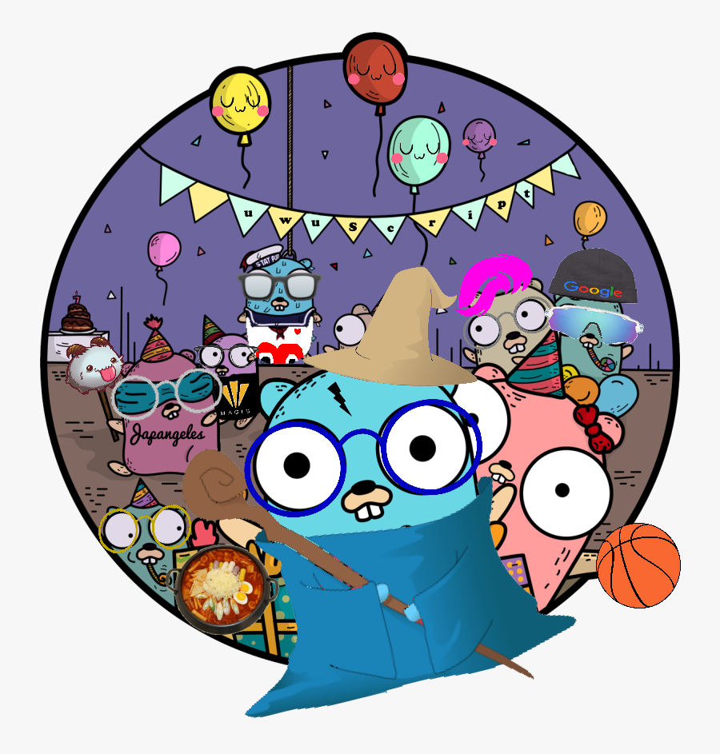

# uwuScript ( ́ ◕◞ε◟◕`)

## Introduction (づ｡◕‿‿◕｡)づ
uwuScript is a cute scripting language that is designed to be fun (and possibly cringey) to use. Because of the use of adorable emoticons and keywords, you will not only feel cuter, but look cuter by the end of developing your program!❀ This language compiles to Javascript and pulls inspiration from other sugoi すごい languages such as Python's list comprehension, Java's static typing, and Swift's for-in loops. 

## Features
* Cuteness
* Scripting Language
* Statically Typed
* List Comprehansion (in-progress)
* For-in/While Loops

## Code Examples
* Top is uwuScript
* Bottom is JavaScript
### Max Number
<pre><code>
Numbwer max(Numbwer n, Numbwer m) uwu
	if (n > m) uwu
    	retuwn n
    owo ewse uwu
    	retuwn m
    owo
owo
</code></pre>

<pre><code>
function max(n, m) {
  if (n > m) {
    return n;
  } else {
    return m;
  }
}
</code></pre>
### Factorial
<pre><code>
Numbwer factorial (Numbwer n) uwu
  if (n == 1)  uwu 
    retuwn 1
  owo ewse uwu
    retuwn n * factorial(n - 1)
  owo
 owo
</code></pre>

<pre><code>
function factorial(n) {
    if(n == 0) {
        return 1
    } else {
        return n * factorial(n - 1);
    }
}
</code></pre>

### Nested for-in loop
<pre><code>
fow i in 0...10 uwu
	fow j in 0...10 uwu
    	pwint(i + j)
  owo
  if (i % 2 == 0) uwu
    aww[i-1] = stwing(i)
  owo
owo
</code></pre>

<pre><code>
for(int i = 0; i <= 10; i++) {
  for(int j = 0; i <= 10; j++) {
    console.log(i + j);
  }
  if (i % 2 == 0) {
    aww[i-1] = i.toString()
  }
}
</code></pre>

