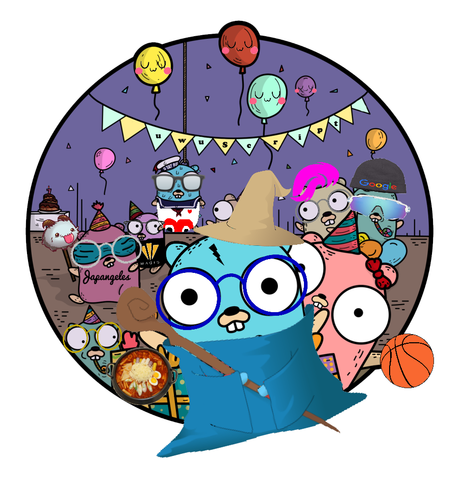

# uwuScript ( ́ ◕◞ε◟◕`)

## Introduction (づ｡◕‿‿◕｡)づ
uwuScript is a cute scripting language that is designed to be fun (and possibly cringey) to use. Because of the use of adorable emoticons and keywords, you will not only feel cuter, but look cuter by the end of developing your program!❀ This language compiles to Javascript and pulls inspiration from other sugoi すごい languages such as Java's static typing and Swift's for-in loops. 

## Features
* Cuteness
* Scripting Language
* Statically Typed
* For-in/While Loops

### Types
* Boowean/Boow
* Stwing
* Numbwer
* Awway/Aww
* Dictionawy/Dict

### Declarations
<pre><code>
Numbwer a = 1
Boowean b = a != 1
Boow c = twue;
Stwing d = "this wetter iz c"
Awway&lt;Stwing&gt; e = ["this", "iz", "an", "awway"]
Dictionawy&lt;Numbwer to Stwing&gt; f = {1 to "one", 2 to "two", 3 to "three"}
</code></pre>

### Unary and Binary Operators
* add <code> + </code>
* subtract <code> - </code>
* multiply <code> * </code>
* divide <code> / </code>
* modulo <code> % </code>
* not <code> ! </code>
* negative <code> - </code>
* equality <code> == </code> or <code> != </code>
* less than <code> < </code>
* less than or equal to <code> <= </code>
* greater than <code> > </code>
* greater than or equal to <code> >= </code>

### Comments
<pre><code> 
Stwing a = "cute"         (*≧ω≦*) uwu
Stwing b = "give" 	  (づ ◕‿◕ )づ here take this
Stwing c = "happy"        (ﾉﾟ▽ﾟ)ﾉ yay it finally works

(╯°益°)╯彡┻━┻ I hate this table
Where did that table go?      ┻━┻
Nevermind that table was pretty cool ┬─┬ノ( º _ ºノ)
</code></pre>
## Code Examples
* Top is uwuScript
* Bottom is JavaScript

### Max Number
<pre><code>
Numbwer max(Numbwer n, Numbwer m) uwu
	if (n > m) uwu
    	retuwn n
    owo ewse uwu
    	retuwn m
    owo
owo
</code></pre>

<pre><code>
function max(n, m) {
  if (n > m) {
    return n;
  } else {
    return m;
  }
}
</code></pre>

### Factorial
<pre><code>
Numbwer factorial (Numbwer n) uwu
  if (n == 1)  uwu 
    retuwn 1
  owo ewse uwu
    retuwn n * factorial(n - 1)
  owo
 owo
</code></pre>

<pre><code>
function factorial(n) {
    if(n == 0) {
        return 1
    } else {
        return n * factorial(n - 1);
    }
}
</code></pre>

### Nested for-in loop
<pre><code>
fow i in 0...10 uwu
  fow j in 0...10 uwu
    pwint(i + j)
  owo
  if (i % 2 == 0) uwu
    aww[i-1] = stwing(i)
  owo
owo
</code></pre>

<pre><code>
for(int i = 0; i <= 10; i++) {
  for(int j = 0; i <= 10; j++) {
    console.log(i + j);
  }
  if (i % 2 == 0) {
    aww[i-1] = i.toString()
  }
}
</code></pre>

